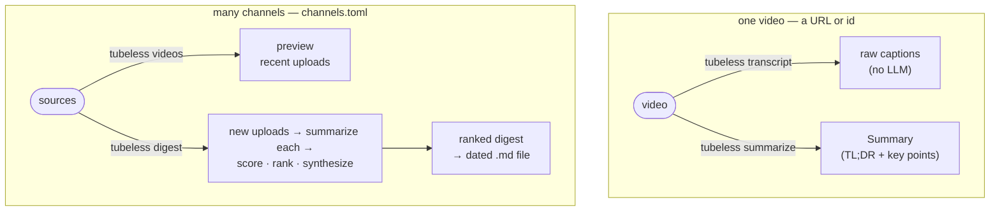

# tubeless

[English](README.md) | **한국어**

유튜브 영상의 자막을 받아 LLM으로 요약합니다 — 명령줄에서 영상 한 개를, 또는
구독하는 채널·시리즈의 하루치 다이제스트를. Gemini(무료)·OpenAI·Claude, 또는
Ollama로 로컬 모델까지 씁니다.




*(`tubeless schedule`은 위 `digest`를 매일 cron으로 대신 돌려줍니다.)*

- [빠른 시작](#빠른-시작)
- [설치](#설치) — macOS, Linux, Windows
- [백엔드: Gemini(무료), Claude, OpenAI, Ollama — 그리고 결제](#백엔드)
- [설정: 키와 기본값](#설정-키와-기본값) (`config.toml` + `credentials.json`)
- [영상 한 개 요약](#영상-한-개-요약) (`--detail` / `--max-points` / `--backend` / `--model` / `--lang`)
- [데일리 다이제스트](#데일리-다이제스트)
- [cron으로 매일 자동 실행 (Linux)](#cron으로-매일-자동-실행-linux)
- [AI 코딩 에이전트에서 쓰기](#ai-코딩-에이전트에서-쓰기) — Claude Code, Codex
- [파이썬 라이브러리로 쓰기](#파이썬-라이브러리로-쓰기)
- [한계](#한계)

### 빠른 시작

```sh
pip install tubeless
```

백엔드를 하나 골라 실행 — 각자 키가 필요합니다(Ollama만 로컬이라 키 불필요):

```sh
# Gemini — 무료 티어, 시작하기 가장 쉬움 (키: https://aistudio.google.com)
export GEMINI_API_KEY=...
tubeless "https://www.youtube.com/watch?v=iG9CE55wbtY" --backend gemini --lang ko

# OpenAI (키: https://platform.openai.com)
export OPENAI_API_KEY=...
tubeless "https://www.youtube.com/watch?v=iG9CE55wbtY" --backend openai --lang ko

# Claude — 먼저: pip install "tubeless[claude]"  (키: https://platform.claude.com)
export CLAUDE_API_KEY=...
tubeless "https://www.youtube.com/watch?v=iG9CE55wbtY" --backend claude --lang ko

# Ollama — 로컬, 키 불필요 (설치: https://ollama.com, 이후: ollama pull llama3.1)
tubeless "https://www.youtube.com/watch?v=iG9CE55wbtY" --backend ollama --lang ko
```

**언어는 가리지 않습니다.** 위 예시는 영어 강연이지만, 비영어 영상을 넣어도 요약합니다
— 기본은 영어, `--lang`으로 원하는 언어로:

```sh
# 한국어 연설 — 기본값은 영어로 요약...
tubeless "https://www.youtube.com/watch?v=5aPe9Uy10n4"
# ...또는 원래 언어(한국어) 그대로
tubeless "https://www.youtube.com/watch?v=5aPe9Uy10n4" --lang ko
```

TL;DR과 핵심 포인트가 터미널에 출력됩니다. 아래는 상세 버전 — OS별 전체 설치(pipx),
각 백엔드 비용·결제처, 키·플래그를 매번 안 치게 하는 config 파일, 여러 채널 데일리 다이제스트.

### 설치

**Python 3.11 이상**이 필요합니다(`python3 --version`으로 확인). [pipx](https://pipx.pypa.io)로
설치하면 `tubeless` 명령이 격리된 환경에 깔려 다른 파이썬 패키지와 충돌하지
않습니다.

tubeless는 PyPI에 있습니다. 본인 OS 블록을 위에서 아래로 그대로 따라가면 됩니다
— 마지막 줄까지 실행하면 `tubeless` 명령을 쓸 수 있습니다.

**macOS**
```sh
brew install python pipx            # 이미 있으면 생략
pipx ensurepath                     # pipx 실행 경로를 PATH에 추가(끝나면 새 터미널 열기)
pipx install tubeless
```

**Linux** (데비안/우분투; 다른 배포판은 각자 패키지매니저 사용)
```sh
sudo apt update && sudo apt install -y python3 python3-pip pipx
pipx ensurepath                     # 끝나면 새 터미널 열기
pipx install tubeless
```

**Windows** (PowerShell)
```powershell
# 1. https://python.org 에서 Python 3.11+ 설치 — "Add python.exe to PATH" 체크.
py -m pip install --user pipx
py -m pipx ensurepath               # 끝나면 PowerShell 닫았다 다시 열기
py -m pipx install tubeless
```

Claude 백엔드까지 함께 설치하려면 `claude` 추가옵션(`anthropic` SDK를 끌어옵니다):
```sh
pipx install "tubeless[claude]"
```

동작 확인:
```sh
tubeless --help
```

> **pipx가 없어도** `pip install tubeless`로 설치됩니다(가상환경 안에서 권장).
> pipx는 CLI를 격리하려는 권장일 뿐입니다. 아직 릴리스 안 된 최신 코드는
> `pipx install git+https://github.com/seokhoonj/tubeless.git`로 설치하세요.

### 백엔드

`--backend`로 LLM을 고릅니다. **Gemini는 무료 티어가 있어 시작이 가장 쉽습니다**
(카드 불필요). 기본은 OpenAI이고, `TUBELESS_BACKEND`로 한 번에 바꿀 수 있습니다
(아래 [설정](#설정-키와-기본값) 참고).

| 백엔드 | 플래그 | 필요한 키 | 기본 모델 | 실행 위치 | 비용 |
|---|---|---|---|---|---|
| **Gemini** | `--backend gemini` | `GEMINI_API_KEY` | `gemini-flash-lite-latest` | Google 서버 | 무료 티어 + 종량제 |
| **Claude** | `--backend claude` | `CLAUDE_API_KEY` | `claude-haiku-4-5` | Anthropic 서버 | 유료, 선불 크레딧 |
| **OpenAI** | `--backend openai` (기본) | `OPENAI_API_KEY` | `gpt-4o-mini` | OpenAI 서버 | 유료, 선불 크레딧 |
| **Ollama** | `--backend ollama` | 불필요 | `llama3.1` | 내 컴퓨터 | 무료 |

**뭘 고를까?** Gemini는 무료 티어라 결제 없이 가장 쉽게 시작합니다. Claude는
불확실한 값을 지어내기보다 *유보*하는 경향이고, OpenAI `gpt-4o-mini`는 싼 클라우드
올라운더입니다. Ollama는 비공개·오프라인·무료 옵션입니다.

#### 모델

각 백엔드는 기본으로 싼 소형 모델을 씁니다. `--model NAME`으로 다른 걸 고르세요.
모델명은 자주 바뀌니 링크의 목록이 정본입니다.

| 백엔드 | 기본 `--model` | 다른 선택지 | 전체 목록 |
|---|---|---|---|
| Gemini | `gemini-flash-lite-latest` (무료) | `gemini-flash-latest`, `gemini-2.5-pro` | [목록](https://ai.google.dev/gemini-api/docs/models) |
| Claude | `claude-haiku-4-5` (가장 쌈) | `claude-sonnet-5`, `claude-opus-4-8` (최고) | [목록](https://platform.claude.com/docs/en/about-claude/models/overview) |
| OpenAI | `gpt-4o-mini` (가장 쌈) | `gpt-4o` | [목록](https://platform.openai.com/docs/models) |
| Ollama | `llama3.1` | 받아둔 모든 모델: `qwen2.5`, `gemma3`, … | [라이브러리](https://ollama.com/library) |

> 이름·수치가 정확히 중요하면 **더 큰 `--model`**이 낫습니다: 작은 기본 모델은
> 노이즈 많은 자동자막의 낯선 이름을, 자기가 아는 비슷한 이름으로 "교정"할 수
> 있습니다(예: 갓 나온 모델명 → 학습 때 아는 옛 이름). 크고 최신인 모델은 이런
> 실수가 훨씬 적습니다.

#### 요금

어디서, 얼마부터 결제하나:

- **Gemini** — [aistudio.google.com](https://aistudio.google.com)에서 키 발급.
  **진짜 무료 티어**(요율 제한)가 있어 결제 없이도 tubeless를 시험해볼 수 있습니다.
  사용량이 많으면 AI Studio에서 종량제를 켭니다. 요금: [Gemini 요금](https://ai.google.dev/pricing).
- **Claude** — **선불**: [platform.claude.com](https://platform.claude.com) → Billing →
  Buy credits에서 구매(**최소 $5**). 기본 `claude-haiku-4-5`는 가장 싼 모델(입력 100만
  토큰당 약 $1 / 출력 $5), 영상 하나에 1~2센트라 $5로 수백 편. 전체 요금:
  [Claude 요금](https://platform.claude.com/docs/en/about-claude/pricing).
- **OpenAI** — **선불**: [platform.openai.com](https://platform.openai.com) → Settings →
  Billing에서 구매(**최소 $5**). 기본 `gpt-4o-mini`가 가장 싼 등급이라 영상당 1센트도
  안 들고, $5면 *수천 편*. 요금: [요금 페이지](https://openai.com/api/pricing/).
- **Ollama** — 키도 청구서도 없습니다. 모델이 내 컴퓨터에서 돕니다(아래 참고).
  무료·오프라인이지만 요약 품질은 로컬 모델 성능만큼입니다.

Claude·OpenAI 크레딧은 구매 **1년 뒤 만료**되고 환불되지 않으니 조금씩 충전하세요.

#### Ollama

서버를 설치하고 모델을 받은 뒤 tubeless를 가리키게 합니다:
```sh
# macOS:   brew install ollama          (또는 https://ollama.com 에서 다운로드)
# Linux:   curl -fsSL https://ollama.com/install.sh | sh
# Windows: https://ollama.com 에서 설치 파일 다운로드
ollama pull llama3.1
tubeless VIDEO_ID_XX --backend ollama --model llama3.1
```
기본이 아닌 호스트는 `OLLAMA_HOST` 환경변수로 지정합니다
(예: `OLLAMA_HOST=http://192.168.0.10:11434`).

**품질은 머신·모델에 좌우됩니다.** 실제 테스트 환경
(Ryzen 3700X / 128GB RAM / RTX 2070 SUPER, VRAM 8GB): `llama3.1`(8B) 같은 소형
모델은 빠르고 대략적인 요지엔 무난했지만, 14B급인 **Qwen 14B는 요약 성능이 그리
좋지 못했습니다** — 14B는 8GB VRAM에 일부만 올라가 CPU/RAM으로 넘치며 느려지고,
숫자·구조 보존이 클라우드 백엔드보다 눈에 띄게 약했습니다. Ollama는 무료·오프
라인·비공개 옵션으로 보고, OpenAI·Claude의 품질 대체재로는 보지 마세요. 요약
품질이 중요하면 클라우드 백엔드를 쓰는 게 좋습니다.

#### Gemini

기본 `gemini-flash-lite-latest`는 가장 싼 등급이고 무료 티어로 돕니다. `--model`로
다른 걸 고를 수 있는데, 실제로 도는지는 키에 달렸습니다:

- **무료 티어**에서는 무료 할당이 있는 모델만 돕니다. `-latest` 별칭
  (`gemini-flash-lite-latest`, `gemini-flash-latest`)이 안전하고, `gemini-2.5-flash`
  같은 고정 이름은 새 키에서 **404**, `gemini-2.0-flash` 등은 무료 할당이 **0**일 수
  있습니다.
- AI Studio에서 **종량제 결제**를 켜면 상위·고정 모델이 열리고 한도도 크게 올라
  갑니다(`429`/`503`이 줄어듦):

  | `--model` | 등급 |
  |---|---|
  | `gemini-flash-lite-latest` | 기본 — 가장 싸고 빠름(무료로 됨) |
  | `gemini-flash-latest` | 풀 flash — 요약 품질 더 좋음 |
  | `gemini-2.5-pro` / `gemini-pro-latest` | pro — 가장 정확·가장 비쌈 |

키가 못 부르는 모델은 크래시 없이 `404`/`429` 한 줄로 알려줍니다 — 모델을 바꾸거나
결제를 켜고 다시 하면 됩니다. 예:

```sh
tubeless VIDEO_ID_XX --backend gemini --model gemini-flash-latest --detail deep
```

### 설정: 키와 기본값

OpenAI·Claude·Gemini는 API 키가 필요합니다(Ollama는 로컬 실행이라 불필요). tubeless는
두 파일로 나눠 둡니다 — **비밀**(API 키·프록시 자격증명)은 소유자만 읽는
`~/.config/tubeless/credentials.json`(권한 `0600`), **비밀 아닌 설정**은
`~/.config/tubeless/config.toml`. 키 값은 화면·로그에 절대 남기지 않습니다.

```sh
mkdir -p ~/.config/tubeless

# 비밀 -> credentials.json (실제로 쓰는 백엔드 키만; 소유자만 읽게 0600)
cat > ~/.config/tubeless/credentials.json <<'EOF'
{
  "OPENAI_API_KEY": "sk-..."
}
EOF
chmod 600 ~/.config/tubeless/credentials.json

# 설정 -> config.toml (전부 선택; 플래그를 매번 안 치도록)
cat > ~/.config/tubeless/config.toml <<'EOF'
# backend    = "gemini"   # 기본 --backend
# model      = "..."      # 기본 --model
# detail     = "deep"     # 기본 --detail (brief|normal|deep)
# max_points = 20         # 기본 --max-points
# lang       = "ko"       # 요약 언어 (기본 en; 한국어 요약은 이 줄의 주석을 푸세요)
# per_channel = 5         # 기본 --per-channel (다이제스트)
EOF
```

`credentials.json`은 `이름: 값` JSON입니다 — 쓰는 백엔드의
`OPENAI_API_KEY`/`CLAUDE_API_KEY`/`GEMINI_API_KEY`(+ 아래 프록시 키)를 넣으세요.
`0600`이 아니면 tubeless가 읽기를 거부하고 `chmod 600` 한 줄을 알려줍니다.

- **OpenAI 키 발급:** [platform.openai.com](https://platform.openai.com) → API keys.
- **Claude 키 발급:** [platform.claude.com](https://platform.claude.com) → API keys.
- **Gemini 키 발급:** [aistudio.google.com](https://aistudio.google.com) → Get API key.

파일 대신 그냥 환경변수로 둬도 됩니다 — tubeless는 `OPENAI_API_KEY` /
`CLAUDE_API_KEY` / `GEMINI_API_KEY`(와 `TUBELESS_*` 설정)를 환경변수에서도 읽고,
환경변수 값이 파일보다 우선합니다.

**기본값을 넣어 플래그를 안 치기.** 위의 `TUBELESS_*`는 각각 해당 옵션의 기본값
입니다. `TUBELESS_BACKEND=gemini`와 `TUBELESS_DETAIL=deep`를 넣으면 `tubeless <url>`
만 쳐도 Gemini로 deep 요약이 됩니다 — 플래그 없이. 특정 명령에 플래그를 주면 그
실행에선 그게 우선하고, 이 값들은 그냥 환경변수로도 동작합니다. 잘못된 값(엉뚱한
detail, 0 이하 숫자)은 한 줄 에러로 알려줍니다.

**`transcript fetch blocked`이 뜰 때 (프록시).** 자막은 YouTube 로그인 없이 익명으로
받아오는데, YouTube는 이 요청을 소스 IP 단위로 속도제한·차단합니다(계정 밴이 아니라
IP 차단 — 바쁜 가정용 IP나 데이터센터 IP 모두). 요청에 계정이 안 실리므로 바꿀 수
있는 건 **출구 IP뿐**이라, 프록시 자격증명을 `credentials.json`에 넣으면 그 IP로
우회합니다(프록시 자격증명도 비밀이라 여기 둡니다):

```json
{
  "TUBELESS_WEBSHARE_USER": "...",
  "TUBELESS_WEBSHARE_PASS": "..."
}
```

`TUBELESS_WEBSHARE_*`가 있으면 Webshare 로테이팅 레지덴셜(차단 시 IP를 돌려가며 재시도
— 이 용도에 가장 안정적), 없으면 `TUBELESS_PROXY_HTTP`(+ 선택 `TUBELESS_PROXY_HTTPS`,
미지정 시 HTTP 값 재사용)의 일반 프록시를 씁니다. 데이터센터/무료 프록시는 YouTube가
함께 막는 경우가 많아 레지덴셜 프록시가 필요할 수 있습니다.

### 영상 한 개 요약

```sh
tubeless "https://www.youtube.com/watch?v=VIDEO_ID_XX" --lang ko
tubeless VIDEO_ID_XX --detail deep --lang ko --max-points 20
```

> **기본 요약 언어는 영어입니다.** 한국어로 요약하려면 `--lang ko`를 붙이거나,
> `~/.config/tubeless/config.toml`에 `lang = "ko"`를 넣어 매번 안 쳐도 되게 하세요.

전체 URL(`watch?v=`, `youtu.be/`, `/shorts/`, `/embed/`, `/live/`)이나 11자리
영상 id만 줘도 됩니다.

> **URL은 따옴표로 감싸세요.** 유튜브 URL엔 `&`가 자주 들어갑니다(예: `...&t=25s`).
> 셸에서 `&`는 "백그라운드 실행"이라, 따옴표 없는 URL은 거기서 잘립니다(`[1] 12345`
> 같은 작업번호와 이상한 출력이 뜸). 따옴표로 감싸면 됩니다:
> `tubeless "https://www.youtube.com/watch?v=VIDEO_ID_XX&t=25s"`. 순수 영상 id는
> 따옴표가 필요 없습니다.

| 옵션 | 뜻 | 기본값 |
|---|---|---|
| `--detail brief\|normal\|deep` | 요약 깊이. **`deep`은 모든 숫자를 보존** — 아래 참고. | `normal` |
| `--max-points N` | 핵심 포인트 최대 개수. `--detail` 기본값(brief 5 / normal 8 / deep 14)을 덮어씀. | 깊이별 |
| `--backend openai\|claude\|gemini\|ollama` | 어떤 LLM을 쓸지. | `openai` |
| `--model NAME` | 모델 id. 미지정 시 백엔드의 소형·저가 모델. | 백엔드별 |
| `--lang CODE` | 요약 언어. 언어 교차 가능 — 한국어 영상을 영어로 요약(한국어 요약은 `--lang ko`). | `en` |
| `--json` | 텍스트 대신 기계용 JSON 출력. | 꺼짐 |

**숫자를 살려주나?** 숫자가 핵심인 영상(증시·실적·스포츠 스코어·스펙표)에 바로
`--detail deep`이 그 용도입니다. `deep`에서는 tubeless가 모델에게 **화자가 말한
모든 수치를 보존**하라고 지시합니다 — 지수 등락·금리·가격·비율, 숫자가 붙은 고유
명사 하나하나를, 적용 시점(연/분기/날짜)과 함께, 한 문장으로 뭉개지 말고 항목별로.
기본 `normal`과 간결한 `brief`는 이렇게 하지 **않습니다** — 읽기 좋은 요점 위주라
일부 숫자를 뺄 수 있습니다. 그래서:

```sh
# 모든 수치가 중요한 시황 정리:
tubeless VIDEO_ID_XX --detail deep

# ...항목이 많으면 포인트 상한을 올려서:
tubeless VIDEO_ID_XX --detail deep --max-points 30
```

**자막만 필요하면?** `tubeless transcript "<url>"`은 LLM 없이 원문 자막을 그대로
출력합니다(`--json`이면 구조화된 형태). 직접 읽거나 파이프로 넘길 때, 또는 요약 전에
자막이 있는지 확인할 때 유용합니다.

### 데일리 다이제스트

영상 한 개 대신, tubeless는 여러 채널을 지켜보며 하루에 마크다운 한 파일을,
중요한 영상부터 순서대로 만들 수 있습니다.

구독할 채널·시리즈를 `~/.config/tubeless/channels.toml`에 적습니다:

```toml
[[channel]]
source = "@examplechannel"      # 핸들 · 채널URL · 'UC...' id · 재생목록
detail = "deep"

[[channel]]
# 'UC...' id를 직접 쓰면 핸들->id 조회를 건너뛰어 가장 안정적입니다
# (채널 페이지 URL이나 '공유'에서 확인).
source = "UCxxxxxxxxxxxxxxxxxxxxxx"
detail = "normal"

[[channel]]
# 재생목록은 채널을 한 시리즈로 좁히고, includes는 제목에 나열된 단어를 모두
# 포함하는 영상만 남깁니다(예: 특정 진행자 회차만). excludes는 나열된 단어가
# 하나라도 든 영상을 제외합니다 -- 예: 같은 회차의 편집본과 함께 올라오는
# "LIVE" 생방송을 건너뜁니다.
source   = "PLxxxxxxxxxxxxxxxxxxxxxxxxxxxxxxxxxx"
detail   = "deep"
includes = ["진행자이름"]
excludes = ["LIVE"]
```

어떤 소스가 뭘 올리는지, 어떤 단어로 거를지 모르겠다면? 최근 업로드를 미리 보세요
(id·게시일·제목; LLM·상태 없음):

```sh
tubeless videos @examplechannel
```

그리고:

```sh
tubeless digest              # ~/.config/tubeless/digests/YYYY-MM-DD.md 로 저장
tubeless digest --dry-run    # 저장 없이 화면에만 출력
```

다이제스트는 **항상 파일 맨 위에 그날의 영상 종합** — 전반 톤, 출처들이 합의하는 것,
갈리는 지점 — 을 답니다. 하루치 요약을 하나로 합치는 것으로, 링크를 챗봇에 붙여넣는
걸로는 못 하는 것(내가 챙겨보는 채널들 *사이를 가로질러* 종합)입니다. 영상 2개
이상일 때 붙고, 그보다 적으면 생략됩니다.

대신 **`--since` / `--until`**을 주면 새로 발견·수집하지 않고 **저장된 요약을 날짜
구간으로 다시 큐레이트**합니다 — 주간·월간 다이제스트:

```sh
tubeless digest --since 2026-07-01 --until 2026-07-08
```

매 (fresh) 실행마다 각 채널의 새 영상을 유튜브 공개 RSS(키 불필요)로 찾아 요약·중요도
채점하고, 하루에 마크다운 한 파일을 중요도순으로 씁니다. 처리한 영상은 JSON
"seen" 세트가 기억하므로 다시 돌리거나(cron으로 매일 돌려도) 같은 영상을 두 번
요약하지 않습니다.

| digest 옵션 | 뜻 | 기본값 |
|---|---|---|
| `--source-match TEXT` | fresh 실행: source에 이 텍스트가 든 채널만. | 전체 |
| `--per-channel N` | fresh 실행: 채널당 확인할 최근 업로드 최대 개수. | `5` |
| `--since` / `--until DATE` | fresh 대신 저장된 요약을 `[since, until)` 구간으로 다시 큐레이트. | fresh |
| `--channel NAME` | `--since`/`--until`과 함께, 그 채널의 저장 요약만 다시 큐레이트. | 전체 |
| `--dry-run` | 저장/상태 갱신 없이 화면 출력만. | 꺼짐 |
| `--channels PATH` | 채널 TOML 파일. | `~/.config/tubeless/channels.toml` |
| `--state PATH` | "이미 본" 상태 파일. | `~/.config/tubeless/state.json` |
| `--out DIR` | 날짜별 다이제스트 파일 디렉터리. | `~/.config/tubeless/digests/` |
| `--corpus DIR` | 저장된 요약·자막 코퍼스 (`--since`/`--until`이 다시 큐레이트하는 대상). | `~/.config/tubeless/corpus/` |
| `--backend` / `--model` / `--lang` | 단건 요약과 동일. | |

### cron으로 매일 자동 실행 (Linux)

cron은 명령을 정해진 시각에 실행합니다. 매일 밤 22:00에 다이제스트를 만들려면:

1. crontab을 엽니다:
   ```sh
   crontab -e
   ```
2. 한 줄 추가합니다(시각 조정 — `0 22 * * *`은 매일 22:00). cron이 찾을 수 있게
   `tubeless`의 전체 경로를 씁니다. 경로는 `which tubeless`로 확인:
   ```cron
   0 22 * * * /home/you/.local/bin/tubeless digest >> /home/you/.config/tubeless/digest.log 2>&1
   ```
   `>> ...digest.log 2>&1`은 정상 출력과 에러를 모두 로그 파일에 덧붙여, 무슨 일이
   있었는지 볼 수 있게 합니다.
3. 저장하고 나옵니다. `crontab -l`로 등록됐는지 확인.

다이제스트가 "seen" 세트를 유지하므로 매일 실행해도 진짜 새 영상만 요약합니다.
결과는 매일 아침 `~/.config/tubeless/digests/`에서 읽으면 됩니다.

> **macOS**도 cron이 있지만 `launchd` / 캘린더로 트리거하는 Automator가 더
> 네이티브합니다. **Windows**: 작업 스케줄러로 `tubeless digest`를 실행하세요.

### AI 코딩 에이전트에서 쓰기

tubeless는 **Claude Code**와 **Codex**용 설치형 플러그인이기도 해서, 에디터를
떠나지 않고 영상을 요약할 수 있습니다. 플러그인은 `tubeless` 명령을 그대로 호출할
뿐이니 **CLI를 먼저 설치하세요**(`pip install tubeless`). 키는 각자
`~/.config/tubeless/credentials.json`에 두며, 플러그인은 지시문만 나르고 키는 절대 담지 않습니다.

#### Claude Code

이 저장소가 곧 플러그인 마켓플레이스입니다. 세션 안에서 slash 명령으로 등록·설치:

```
/plugin marketplace add seokhoonj/tubeless
/plugin install tubeless@tubeless
```

또는, `claude`를 실행하기 전에 터미널에서 동일하게:

```
claude plugin marketplace add seokhoonj/tubeless
claude plugin install tubeless@tubeless
```

이후 유튜브 URL을 붙여넣으면 스킬이 알아서 발동하거나, 직접 호출합니다(백엔드는
CLI와 동일하게 `--backend claude` 등으로 지정):

```
/tubeless:summarize https://youtu.be/VIDEO_ID_XX
```

#### Codex

같은 저장소가 Codex 플러그인도 함께 배포합니다:

```
codex plugin marketplace add seokhoonj/tubeless
codex plugin add tubeless@tubeless
```

`summarize` 스킬이 유튜브 URL에 발동하거나, `tubeless summarize <url>`을 직접
실행하면 됩니다.

#### 직접 엮기 (아무 에이전트나)

`~/.claude/skills/tubeless/SKILL.md`를 만들어(내 머신에만 남는 로컬 파일, 추적 안 됨)
CLI를 호출하게 합니다:

```markdown
---
name: tubeless
description: 유튜브 영상을 요약. 유튜브 URL이나 "이 영상 요약해줘"에 반응.
---

사용자가 준 URL로 설치된 `tubeless` CLI를 실행하고 결과를 보여준다:

    tubeless summarize "<url>" --detail deep --lang ko

TL;DR과 핵심 포인트를 사용자에게 돌려준다.
```

### 파이썬 라이브러리로 쓰기

```python
from tubeless import OpenAIBackend, fetch_transcript, fetch_video, summarize_transcript

# 원자를 조합합니다: 영상 메타데이터와 자막을 받아 요약합니다.
transcript = fetch_transcript(fetch_video("https://youtu.be/VIDEO_ID_XX"))
summary    = summarize_transcript(transcript, OpenAIBackend(), detail="deep")
print(summary.tldr)
for point in summary.points:
    print("-", point)
```

자막은 자기 영상을 품고 있으므로, 이미 자막을 갖고 있으면
`summarize_transcript(transcript, backend, detail=...)` 하나가 코어 전부입니다.

`ClaudeBackend`·`OllamaBackend`는 `OpenAIBackend`와 그대로 바꿔 끼울 수
있습니다. 다이제스트 조각(`fetch_recent_videos`, `summarize_videos`,
`curate_summaries`, `render_markdown`, `FileStore`, `latest_per_video`)도
export되어 있습니다.

### 동작 방식

코어는 도메인 중립 단건 엔진입니다 — 영상을 식별하고, 자막을 받아, 교체 가능한
LLM 백엔드로 요약합니다(긴 자막은 map-reduce로 나눠 아무것도 잘리지 않게).
다이제스트 층은 그 위에 피드·중요도 점수·마크다운 렌더러를 얹은 것으로, 역시
도메인 중립입니다. 요약은 자막에 실제로 담긴 내용에 맞춰 적응하며, 그래서 같은 도구가
시황 정리에도, 강의에도, 경기 리포트에도 통합니다.

### 한계

- **자막이 없는 영상은 요약할 수 없습니다.** tubeless는 자막을 읽을 뿐, 음성을
  직접 받아쓰지 **않습니다**(STT 폴백 없음). 자막이 꺼졌거나 요청 언어에 없는
  영상은 건너뜁니다(다이제스트에서는 "Videos without a transcript"로 표시).
- **자동 생성 자막은 노이즈가 있습니다.** 자막이 자동 생성일 때 tubeless는 모델
  에게 불확실한 이름·숫자를 단정하지 말고 유보하라고 경고하지만, 뭉개진 자막은
  여전히 뭉개진 포인트를 낳을 수 있습니다.
- **클라우드 백엔드 요약은 유료입니다**([백엔드](#백엔드) 참고).
  무료·오프라인으로 쓰려면 Ollama를 쓰세요.
- **중요도 점수는 모델의 판단**이지 확정 지표가 아닙니다 — 다이제스트를 정렬할
  뿐 정답은 아닙니다.

### 라이선스

MIT — [LICENSE](LICENSE) 참고.
