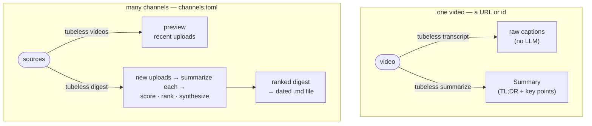

# tubeless

[](https://github.com/seokhoonj/tubeless/actions/workflows/check.yml)
[](https://pypi.org/project/tubeless/)
[](https://pypi.org/project/tubeless/)
[](https://github.com/seokhoonj/tubeless/blob/main/LICENSE)

Fetch a YouTube video's transcript and summarize it with an LLM — one video from
the command line, or a daily digest of the channels and series you follow.
Works with Gemini (free), OpenAI, Claude, or a local model via Ollama.



*(`tubeless schedule` just runs `digest` for you every day via cron.)*

**English** | [한국어](README.ko.md)

---

- [Quick start](#quick-start)
- [Install](#install) — macOS, Linux, Windows
- [Backends: Gemini (free), Claude, OpenAI, Ollama — and what each costs](#backends)
- [Set up config: keys and defaults](#set-up-config-keys-and-defaults) (`config.toml` + `credentials.json`)
- [Summarize one video](#summarize-one-video) (`--detail` / `--max-points` / `--backend` / `--model` / `--lang`)
- [Daily digest](#daily-digest)
- [Run it every day with cron (Linux)](#run-it-every-day-with-cron-linux)
- [Use it from an AI coding agent](#use-it-from-an-ai-coding-agent) — Claude Code, Codex
- [Use it as a Python library](#use-it-as-a-python-library)
- [Limits](#limits)

### Quick start

```sh
pip install tubeless
```

Then pick a backend and run — each needs its own key, except Ollama, which runs
locally with none:

```sh
# Gemini — free tier, easiest to start (key: https://aistudio.google.com)
export GEMINI_API_KEY=...
tubeless "https://www.youtube.com/watch?v=iG9CE55wbtY" --backend gemini

# OpenAI (key: https://platform.openai.com)
export OPENAI_API_KEY=...
tubeless "https://www.youtube.com/watch?v=iG9CE55wbtY" --backend openai

# Claude (key: https://platform.claude.com)
export CLAUDE_API_KEY=...
tubeless "https://www.youtube.com/watch?v=iG9CE55wbtY" --backend claude

# Ollama — local, no key (install: https://ollama.com, then: ollama pull llama3.1)
tubeless "https://www.youtube.com/watch?v=iG9CE55wbtY" --backend ollama
```

**Any language works.** The examples above are an English talk; point tubeless at
a non-English video and it still summarizes — into English by default, or in
whatever `--lang` you ask for:

```sh
# a Korean-language speech — summarized in English by default...
tubeless "https://www.youtube.com/watch?v=5aPe9Uy10n4"
# ...or keep it in the original language
tubeless "https://www.youtube.com/watch?v=5aPe9Uy10n4" --lang ko
```

A TL;DR and key points print to your terminal. Everything below is the detailed
version — full install (pipx, per-OS), what each backend costs and where to pay,
a config file so you never retype a key or flag, and the daily multi-channel digest.

### Install

You need **Python 3.11 or newer**. Check with `python3 --version`. Installing with
[pipx](https://pipx.pypa.io) keeps the `tubeless` command in its own isolated
environment so it never clashes with your other Python packages.

tubeless is on PyPI. Follow the block for your OS top to bottom — after the last
line, the `tubeless` command is on your PATH.

**macOS**
```sh
brew install python pipx            # skip if you already have them
pipx ensurepath                     # adds pipx's bin dir to PATH (open a new terminal after)
pipx install tubeless
```

**Linux** (Debian/Ubuntu; use your distro's package manager elsewhere)
```sh
sudo apt update && sudo apt install -y python3 python3-pip pipx
pipx ensurepath                     # open a new terminal afterwards
pipx install tubeless
```

**Windows** (PowerShell)
```powershell
# 1. Install Python 3.11+ from https://python.org — tick "Add python.exe to PATH".
py -m pip install --user pipx
py -m pipx ensurepath               # close and reopen PowerShell afterwards
py -m pipx install tubeless
```

Every backend works out of the box -- both provider SDKs ship with tubeless, so
no extra is needed for Claude.

Confirm it works:
```sh
tubeless --help
```

> **No pipx?** Plain `pip install tubeless` works too (ideally inside a
> virtualenv). pipx is only recommended so the CLI stays isolated. To install the
> newest unreleased code instead, use
> `pipx install git+https://github.com/seokhoonj/tubeless.git`.

### Backends

Pick the LLM with `--backend`. **Gemini has a free tier, so it's the easiest way
to start** (no card needed). OpenAI is the built-in default; change it once with
`TUBELESS_BACKEND` (see [config](#set-up-config-keys-and-defaults)).

| backend | flag | key needed | default model | runs where | cost |
|---|---|---|---|---|---|
| **Gemini** | `--backend gemini` | `GEMINI_API_KEY` | `gemini-flash-lite-latest` | Google's servers | free tier + pay-as-you-go |
| **Claude** | `--backend claude` | `CLAUDE_API_KEY` | `claude-haiku-4-5` | Anthropic's servers | paid, prepaid credits |
| **OpenAI** | `--backend openai` (default) | `OPENAI_API_KEY` | `gpt-4o-mini` | OpenAI's servers | paid, prepaid credits |
| **Ollama** | `--backend ollama` | none | `llama3.1` | your own machine | free |

**Which to choose?** Gemini's free tier is the easiest way to start without
paying. Claude tends to *hedge* an uncertain specific rather than invent one;
OpenAI `gpt-4o-mini` is a cheap cloud all-rounder. Ollama is the
private/offline/free option.

#### Models

Each backend uses a cheap small model by default; pass `--model NAME` to pick
another. Model names shift often, so the linked list is the authoritative one.

| backend | default `--model` | other options | full list |
|---|---|---|---|
| Gemini | `gemini-flash-lite-latest` (free) | `gemini-flash-latest`, `gemini-2.5-pro` | [models](https://ai.google.dev/gemini-api/docs/models) |
| Claude | `claude-haiku-4-5` (cheapest) | `claude-sonnet-5`, `claude-opus-4-8` (best) | [models](https://platform.claude.com/docs/en/about-claude/models/overview) |
| OpenAI | `gpt-4o-mini` (cheapest) | `gpt-4o` | [models](https://platform.openai.com/docs/models) |
| Ollama | `llama3.1` | any pulled model: `qwen2.5`, `gemma3`, … | [library](https://ollama.com/library) |

> A bigger `--model` is worth it when exact names and figures matter: a small
> default model can "correct" an unfamiliar name in a noisy auto-caption to a
> similar one it knows (e.g. a brand-new model name → an older one it was trained
> on). A larger, more recent model does this far less.

#### Pricing

Where to pay, and how much:

- **Gemini** — get a key at [aistudio.google.com](https://aistudio.google.com).
  Gemini has a **genuine free tier** (rate-limited) — enough to try tubeless
  without paying at all. For higher volume, enable pay-as-you-go billing in AI
  Studio. Rates: [Gemini pricing](https://ai.google.dev/pricing).
- **Claude** — **prepaid**: buy credits at [platform.claude.com](https://platform.claude.com)
  → Billing → Buy credits (**$5 minimum**). The default `claude-haiku-4-5` is
  Anthropic's cheapest model (~$1 / $5 per million input / output tokens); a
  typical video is a cent or two, so $5 covers hundreds. Full rates: [Claude pricing](https://platform.claude.com/docs/en/about-claude/pricing).
- **OpenAI** — **prepaid**: buy credits at [platform.openai.com](https://platform.openai.com)
  → Settings → Billing (**$5 minimum**). The default `gpt-4o-mini` is the cheapest
  tier — a fraction of a cent per video, so $5 covers *thousands*. Prices: [pricing](https://openai.com/api/pricing/).
- **Ollama** — no key, no bill; the model runs on your own computer (see below).
  Free and offline, at the cost of the summary quality your local model can give.

Prepaid credits (Claude, OpenAI) **expire one year** after purchase and are
non-refundable — so top up small.

#### Ollama

Install the server, pull a model, then point tubeless at it:
```sh
# macOS:   brew install ollama          (or download from https://ollama.com)
# Linux:   curl -fsSL https://ollama.com/install.sh | sh
# Windows: download the installer from https://ollama.com
ollama pull llama3.1
tubeless VIDEO_ID_XX --backend ollama --model llama3.1
```
Point at a non-default host with the `OLLAMA_HOST` environment variable
(e.g. `OLLAMA_HOST=http://192.168.0.10:11434`).

**Quality depends on your machine and model.** Tested on a
Ryzen 3700X / 128 GB RAM / RTX 2070 SUPER (8 GB VRAM): a small model like
`llama3.1` (8B) runs fast and is fine for a quick gist, but a 14B model such as
**Qwen 14B did not perform that well** for summarization here — a 14B only partly
fits in 8 GB of VRAM, so it spills over to the CPU/RAM and runs slower, and its
summaries held numbers and structure noticeably worse than the cloud backends.
Treat Ollama as the free / offline / private option, not a quality match for
OpenAI or Claude; when summary quality matters, use a cloud backend.

#### Gemini

The default `gemini-flash-lite-latest` is the cheapest tier and runs on the free
tier. Pass `--model` to pick another —
what actually runs depends on your key:

- On the **free tier**, only models with free quota run. The `-latest` aliases
  (`gemini-flash-lite-latest`, `gemini-flash-latest`) are the safe picks; pinned
  names like `gemini-2.5-flash` can return **404** for a newly created key, and
  some (e.g. `gemini-2.0-flash`) have **zero** free quota.
- With **pay-as-you-go billing** enabled in AI Studio, the higher-quality and
  pinned models open up, with much higher rate limits (fewer `429`/`503`):

  | `--model` | tier |
  |---|---|
  | `gemini-flash-lite-latest` | default — cheapest & fastest (works free) |
  | `gemini-flash-latest` | full flash — better summaries |
  | `gemini-2.5-pro` / `gemini-pro-latest` | pro — most accurate, most expensive |

A model your key can't call just returns a one-line `404`/`429` (no crash) —
switch model or enable billing and retry. Example:

```sh
tubeless VIDEO_ID_XX --backend gemini --model gemini-flash-latest --detail deep
```

### Set up config: keys and defaults

OpenAI, Claude, and Gemini need an API key (Ollama runs locally and needs none).
tubeless keeps two files: **secrets** (API keys, proxy credentials) go in
`~/.config/tubeless/credentials.json`, readable only by you (mode `0600`); the
**non-secret settings** go in `~/.config/tubeless/config.toml`. The key value is
never printed or logged.

```sh
mkdir -p ~/.config/tubeless

# secrets -> credentials.json (only the backend key(s) you use; owner-readable only)
cat > ~/.config/tubeless/credentials.json <<'EOF'
{
  "OPENAI_API_KEY": "sk-..."
}
EOF
chmod 600 ~/.config/tubeless/credentials.json

# settings -> config.toml (all optional; so you don't retype flags)
cat > ~/.config/tubeless/config.toml <<'EOF'
# backend    = "gemini"   # default --backend
# model      = "..."      # default --model
# detail     = "deep"     # default --detail (brief|normal|deep)
# max_points = 20         # default --max-points
# lang       = "ko"       # summary language (default: en; set ko for Korean)
# per_channel = 5         # default --per-channel (digest)
# data_dir   = "..."      # move the corpus + digests off the default (see "Where files are stored")
# state_dir  = "..."      # move the state ledger + log off the default (rarely needed)
EOF
```

(All lines are commented; uncomment only what you want to change. tubeless ignores
`#` lines, so they double as in-file notes on what is available.)

`credentials.json` is a `name: value` JSON map — put the
`OPENAI_API_KEY` / `CLAUDE_API_KEY` / `GEMINI_API_KEY` for the backend you use (plus
the proxy keys below). If it is not `0600`, tubeless refuses to read it and prints
the one-line `chmod 600` that fixes it.

- **Get an OpenAI key:** [platform.openai.com](https://platform.openai.com) → API keys.
- **Get a Claude key:** [platform.claude.com](https://platform.claude.com) → API keys.
- **Get a Gemini key:** [aistudio.google.com](https://aistudio.google.com) → Get API key.

You can also just set these as environment variables instead of using the files —
tubeless reads `OPENAI_API_KEY` / `CLAUDE_API_KEY` / `GEMINI_API_KEY` (and the
`TUBELESS_*` settings) from the environment too, and an environment value overrides
the file.

**Set defaults so you never retype a flag.** Each `TUBELESS_*` above is the
default for the matching option. Put `TUBELESS_BACKEND=gemini` and
`TUBELESS_DETAIL=deep` in the file and a bare `tubeless <url>` runs Gemini at
deep detail — no flags. An explicit flag on a command still wins for that run,
and these work as plain environment variables too. An invalid value (a bad
detail, a non-positive number) is reported as a one-line error.

**When you hit `transcript fetch blocked` (proxy).** Transcripts are fetched
anonymously (no YouTube login), and YouTube rate-limits or blocks that request per
source IP — a busy residential ISP or a datacenter range alike, and it is the IP
that is blocked, not any account. The request carries no account, so the exit IP
is the only thing you can change: put proxy credentials in `credentials.json` (they
are secrets too) and the fetch routes through it:

```json
{
  "TUBELESS_WEBSHARE_USER": "...",
  "TUBELESS_WEBSHARE_PASS": "..."
}
```

`TUBELESS_WEBSHARE_*` uses Webshare rotating residential (rotates the IP and retries
on a block — the most reliable for this); otherwise the generic `TUBELESS_PROXY_HTTP`
(plus optional `TUBELESS_PROXY_HTTPS`, which reuses the HTTP value if unset) is used.
Datacenter and free proxies are often blocked by YouTube too, so a residential proxy
may be required.

### Where files are stored

tubeless keeps its files by *kind*, each in its XDG base directory. The layout is
the same on every OS (macOS and Windows included -- the convention git / ssh / aws
use there), honouring the `XDG_*_HOME` env vars:

| Kind | Holds | Default | Override with |
|---|---|---|---|
| **config** | `config.toml`, `credentials.json`, `channels.toml` | `~/.config/tubeless` | `XDG_CONFIG_HOME` |
| **data** | `corpus/` (transcripts + summaries), `digests/` | `~/.local/share/tubeless` | `data_dir` in `config.toml`, `TUBELESS_DATA_DIR`, or `XDG_DATA_HOME` |
| **state** | `state.json` (processed ids), `digest.log` | `~/.local/state/tubeless` | `state_dir` in `config.toml`, `TUBELESS_STATE_DIR`, or `XDG_STATE_HOME` |

Config, data, and state are separate so resetting your settings (`rm -rf
~/.config/tubeless`) never touches the corpus, and a config backup stays small.

**To keep a large corpus on another volume**, set `data_dir` in `config.toml` — it is
read every run, so an interactive run and the cron digest agree without setting any
environment variable:

```toml
# ~/.config/tubeless/config.toml
# data_dir  = "/path/to/bigdisk/tubeless"   # move corpus + digests here (default: ~/.local/share/tubeless)
# state_dir = "/path/to/bigdisk/state"      # move state here            (default: ~/.local/state/tubeless)
```

`/path/to/bigdisk` is a placeholder — replace it with any absolute path (an external
drive, another partition, a network share). Given as an explicit path (used as-is,
`~` expanded — no app name appended). An
`XDG_*_HOME` environment variable moves *every* XDG app's dir; the `config.toml` key
and the `--corpus`/`--out`/`--state` flags move only tubeless. `config_dir` itself
cannot be set in `config.toml` (that is where `config.toml` lives) — move it with
`XDG_CONFIG_HOME` if ever needed. After relocating, move the existing files once (e.g.
`mv ~/.local/share/tubeless/* /path/to/bigdisk/tubeless/`).

### Summarize one video

```sh
tubeless "https://www.youtube.com/watch?v=VIDEO_ID_XX"
tubeless VIDEO_ID_XX --detail deep --lang en --max-points 20
```

You can pass a full URL (`watch?v=`, `youtu.be/`, `/shorts/`, `/embed/`,
`/live/`) or just the bare 11-character video id.

> **Quote the URL.** A YouTube URL often contains `&` (e.g. `...&t=25s`), and in a
> shell `&` means "run in the background" — an unquoted URL gets split there (you'll
> see a `[1] 12345` job number and odd output). Wrap it in quotes:
> `tubeless "https://www.youtube.com/watch?v=VIDEO_ID_XX&t=25s"`. A bare video id
> needs no quotes.

| option | what it does | default |
|---|---|---|
| `--detail brief\|normal\|deep` | How full the summary is. **`deep` keeps every number** — see below. | `normal` |
| `--max-points N` | Max key points. Overrides the per-detail default (brief 5 / normal 8 / deep 14). | per-detail |
| `--backend openai\|claude\|gemini\|ollama` | Which LLM to use. | `openai` |
| `--model NAME` | Model id. Defaults to the backend's small/cheap model. | per-backend |
| `--lang CODE` | Language of the summary. Works across languages — a Korean video can be summarized in English (`--lang ko` for Korean). | `en` |
| `--json` | Print machine-readable JSON instead of text. | off |

**Does it keep the numbers?** For number-heavy videos (markets, earnings, sports
scores, spec sheets), that is exactly what `--detail deep` is for. At `deep`,
tubeless instructs the model to **preserve every figure the speaker states** —
each index move, rate, price, percentage, and named entity with its number —
attached to its period (the year/quarter/date it applies to) and kept item by
item instead of collapsed into one vague sentence. The default `normal` and the
terse `brief` do **not** do this — they favor readable points and may drop some
numbers. So:

```sh
# A market recap where every figure matters:
tubeless VIDEO_ID_XX --detail deep

# ...and raise the point cap if the video lists many items:
tubeless VIDEO_ID_XX --detail deep --max-points 30
```

**Just the transcript?** `tubeless transcript "<url>"` prints the raw captions
with no LLM call (add `--json` for the structured form) — handy to read or pipe
the text yourself, or to check a video even has captions before summarizing.

### Daily digest

Instead of one video, tubeless can watch a set of channels and produce one
Markdown file a day, with the most important videos first.

List the channels and series you follow in `~/.config/tubeless/channels.toml`:

```toml
[[channel]]
source = "@examplechannel"      # a handle, channel URL, 'UC...' id, or playlist
detail = "deep"

[[channel]]
# A bare 'UC...' id skips the handle-to-id lookup, so it is the most stable form
# (find it in the channel page's URL, or via 'Share' on the channel).
source = "UCxxxxxxxxxxxxxxxxxxxxxx"
detail = "normal"

[[channel]]
# A playlist narrows a channel to one series; includes narrows it further to
# uploads whose title contains every listed word (e.g. one recurring host).
# excludes then drops uploads carrying any listed word -- e.g. skip the "LIVE"
# broadcast a channel keeps alongside an edited replay of the same episode.
source   = "PLxxxxxxxxxxxxxxxxxxxxxxxxxxxxxxxxxx"
detail   = "deep"
includes = ["Some Host"]
excludes = ["LIVE"]
```

Not sure what a source posts, or which words to filter on? Preview its recent
uploads (id, published date, title; no LLM, no state):

```sh
tubeless videos @examplechannel
```

Then run:

```sh
tubeless digest              # write ~/.local/share/tubeless/digests/YYYY-MM-DD.md
tubeless digest --dry-run    # print it instead, and don't record state
```

Each run also writes a `YYYY-MM-DD.json` beside the Markdown: a point-in-time
record of the digest — the ranked entries, what was skipped, and the run
provenance (which channels and which model produced it). The Markdown is a view;
the JSON is the record, so a later analysis can see exactly what was concluded on a
given day even after the channels or the model change.

Each run finds every channel's new uploads via YouTube's public RSS feed (no API
key), summarizes and importance-scores them, and writes one Markdown file per day
ranked most-important first. A JSON "seen" set remembers what it already handled,
so running it again (or daily from cron) never re-summarizes the same video.

The digest always **leads with a cross-video read of the day** — the overall
tone, what the sources agree on, and where they diverge — combining every summary
into one briefing. This is the thing a per-link paste into a chatbot can't do: it
synthesizes *across* the channels you follow (whenever there are two or more
videos; with fewer it is simply omitted).

Pass **`--since` / `--until`** instead to re-curate already-stored summaries over
a date range — a weekly or monthly read — without discovering or re-fetching
anything:

```sh
tubeless digest --since 2026-07-01 --until 2026-07-08
```

| digest option | what it does | default |
|---|---|---|
| `--source-match TEXT` | Fresh run: only channels whose source contains this text. | all |
| `--per-channel N` | Fresh run: max recent uploads to check per channel. | `5` |
| `--since` / `--until DATE` | Re-curate stored summaries over `[since, until)` instead of a fresh run. | fresh run |
| `--channel NAME` | With `--since`/`--until`, re-curate only that channel's stored summaries. | all |
| `--dry-run` | Print the digest instead of writing it / updating state. | off |
| `--channels PATH` | Channels TOML file. | `~/.config/tubeless/channels.toml` |
| `--state PATH` | The "already seen" state file. | `~/.local/state/tubeless/state.json` |
| `--out DIR` | Directory for the dated digest file. | `~/.local/share/tubeless/digests/` |
| `--corpus DIR` | Corpus of stored summaries/transcripts (what `--since`/`--until` re-curates). | `~/.local/share/tubeless/corpus/` |
| `--backend` / `--model` / `--lang` | Same as for a single video. | |

### Run it every day with cron (Linux)

Cron runs a command on a schedule. To build the digest every night at 22:00:

1. Open your crontab:
   ```sh
   crontab -e
   ```
2. Add one line (adjust the time — `0 22 * * *` means 22:00 daily). Use the full
   path to `tubeless` so cron can find it; get it with `which tubeless`:
   ```cron
   0 22 * * * /home/you/.local/bin/tubeless digest >> /home/you/.local/state/tubeless/digest.log 2>&1
   ```
   `>> ...digest.log 2>&1` appends both normal output and errors to a log file so
   you can see what happened.
3. Save and exit. Check it's registered with `crontab -l`.

Because the digest keeps a "seen" set, a daily run only summarizes genuinely new
uploads. Read the result each morning at `~/.local/share/tubeless/digests/`.

> **macOS** has cron too, but `launchd` / a Calendar-triggered Automator action
> is the native way. **Windows**: use Task Scheduler to run `tubeless digest`.

### Use it from an AI coding agent

tubeless is also an installable plugin for **Claude Code** and **Codex**, so you
can summarize a video without leaving your editor. The plugin only shells out to
the `tubeless` command, so **install the CLI first** (`pip install tubeless`);
your keys stay in your own `~/.config/tubeless/credentials.json` — the plugin ships only the
instructions, never a key.

#### Claude Code

This repo doubles as a plugin marketplace. Register and install it from inside a
session with slash commands:

```
/plugin marketplace add seokhoonj/tubeless
/plugin install tubeless@tubeless
```

or, equivalently, from your terminal before launching `claude`:

```
claude plugin marketplace add seokhoonj/tubeless
claude plugin install tubeless@tubeless
```

Then paste a YouTube URL (the skill triggers on its own), or run it explicitly —
picking a backend the same way as the CLI (`--backend claude`, `--backend ollama`, ...):

```
/tubeless:summarize https://youtu.be/VIDEO_ID_XX
```

#### Codex

The same repo also ships a Codex plugin:

```
codex plugin marketplace add seokhoonj/tubeless
codex plugin add tubeless@tubeless
```

The `summarize` skill triggers on a YouTube URL, or run `tubeless summarize <url>`
directly.

#### By hand (any agent)

Or wire it up yourself — drop a `SKILL.md` in `~/.claude/skills/tubeless/` (Claude Code) or
`~/.codex/skills/tubeless/` (Codex) — local to your machine, not tracked — that shells out to
the CLI:

```markdown
---
name: tubeless
description: Summarize a YouTube video. Trigger on a YouTube URL or "summarize this video".
---

Run the installed `tubeless` CLI on the URL the user gave and show the result:

    tubeless summarize "<url>" --detail deep

Show the TL;DR and key points back to the user.
```

### Use it as a Python library

```python
from tubeless import fetch_transcript, fetch_video, make_backend, summarize_transcript

# Compose the atoms: fetch the video's metadata and transcript, then summarize.
transcript = fetch_transcript(fetch_video("https://youtu.be/VIDEO_ID_XX"))
summary    = summarize_transcript(transcript, make_backend("openai"), detail="deep")
print(summary.tldr)
for point in summary.points:
    print("-", point)
```

The transcript carries its own video, so `summarize_transcript(transcript,
backend, detail=...)` is the whole core once you already hold one.

Pass another vendor to `make_backend` (`"claude"`, `"gemini"`, `"ollama"`) to
switch. The digest pieces (`fetch_recent_videos`, `summarize_videos`,
`curate_summaries`, `render_markdown`, `FileStore`, `latest_per_video`) are
exported too.

### How it works

The core is a domain-neutral single-video engine: identify the video, fetch its
transcript, and summarize it through a pluggable LLM backend (map-reducing long
transcripts so nothing is truncated). The digest layer is built on top — feeds,
an importance score, and a Markdown renderer — and stays domain-neutral too; the
summary adapts to whatever the transcript actually contains, which is why the
same tool works for a market recap, a lecture, or a match report.

### Limits

- **A video with no captions needs the optional whisper fallback.** By default
  tubeless reads captions only, so a video with no captions at all is skipped (in a
  digest, listed under "Videos without a transcript") — a video captioned only in
  another language is still summarized, since the caption language need not match the
  summary. To transcribe the caption-less videos too, install `tubeless[whisper]` and
  set `TUBELESS_WHISPER_MODEL` (e.g. `small`): tubeless then downloads the audio and
  runs faster-whisper locally, off by default because that step is heavy work the
  caption path avoids.
- **Auto-generated captions are noisy.** When the caption track is auto-generated,
  tubeless warns the model to hedge uncertain names and numbers rather than state
  them as fact — but a garbled caption can still produce a garbled point.
- **Summaries cost money on the cloud backends** (see [Backends](#backends)).
  Use Ollama to run free and offline.
- **The importance score is the model's judgment**, not a hard metric — it ranks
  the digest, it isn't ground truth.

### License

MIT — see [LICENSE](LICENSE).

